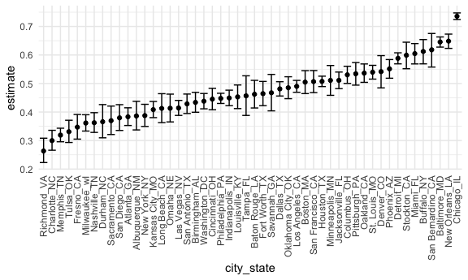
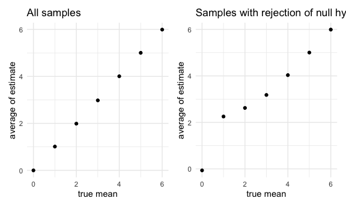

Homework 5
================
Vera Xu

This is my solution to HW5.

``` r
library(tidyverse)

knitr::opts_chunk$set(
  fig.width = 6,
  fig.asp = .6,
  out.width = "90%"
  )

theme_set(theme_minimal() + theme(legend.position = "bottom"))

options(
  ggplot2.continuous.colour = "viridis",
  ggplot2.continuous.fill = "viridis"
  )

scale_colour_discrete = scale_color_viridis_d
scale_fill_discrete = scale_fill_viridis_d
```

## Problem 1 demo by Jeff in class

Read in the data.

``` r
homicide_df = 
  read_csv("data/homicide-data.csv") %>% 
  mutate(
    city_state = str_c(city, state, sep = "_"),
    resolved = case_when(
      disposition == "Closed without arrest" ~ "unsolved",
      disposition == "Open/No arrest"        ~ "unsolved",
      disposition == "Closed by arrest"      ~ "solved",
    )
  ) %>% 
  select(city_state, resolved) %>% 
  filter(city_state != "Tulsa_AL")
```

Let’s look at this a bit

``` r
aggregate_df = 
  homicide_df %>% 
  group_by(city_state) %>% 
  summarize(
    hom_total = n(),
    hom_unsolved = sum(resolved == "unsolved")
  )
```

Can I do a prop test for a single city?

``` r
prop.test(
  aggregate_df %>% filter(city_state == "Baltimore_MD") %>% pull(hom_unsolved), 
  aggregate_df %>% filter(city_state == "Baltimore_MD") %>% pull(hom_total)
  ) %>% 
  broom::tidy()
```

    ## # A tibble: 1 x 8
    ##   estimate statistic  p.value parameter conf.low conf.high method    alternative
    ##      <dbl>     <dbl>    <dbl>     <int>    <dbl>     <dbl> <chr>     <chr>      
    ## 1    0.646      239. 6.46e-54         1    0.628     0.663 1-sample… two.sided

Try to iterate ……..

``` r
results_df = 
  aggregate_df %>% 
  mutate(
    prop_tests = map2(.x = hom_unsolved, .y = hom_total, ~prop.test(x = .x, n = .y)),
    tidy_tests = map(.x = prop_tests, ~broom::tidy(.x))
  ) %>% 
  select(-prop_tests) %>% 
  unnest(tidy_tests) %>% 
  select(city_state, estimate, conf.low, conf.high)
```

``` r
results_df %>% 
  mutate(city_state = fct_reorder(city_state, estimate)) %>% 
  ggplot(aes(x = city_state, y = estimate)) +
  geom_point() + 
  geom_errorbar(aes(ymin = conf.low, ymax = conf.high)) + 
  theme(axis.text.x = element_text(angle = 90, vjust = 0.5, hjust = 1))
```



## Problem 2

##### Create a dataframe containing all file names for p2

``` r
p2_list = 
  list.files("./data/p2_data")
```

##### Iterate over file names and read in data for each subject

``` r
p2_load = function(file_list) 
  {
  path = str_c("./data/p2_data/", file_list)
  read_csv(path)
  }

p2_data = 
  purrr::map(p2_list, p2_load) %>%
  bind_rows() %>%
  mutate(file_name = p2_list)
```

##### Tidy the result

``` r
p2_tidy_data = 
  p2_data %>%
  mutate(file_name = gsub(".csv", "", file_name)) %>%
  separate(file_name, into = c("trt_group", "id"), sep = "_") %>%
  pivot_longer(week_1:week_8, 
               names_to = "week",
               values_to = "value") %>%
  mutate(week = gsub("week_", "", week))

p2_tidy_data
```

    ## # A tibble: 160 x 4
    ##    trt_group id    week  value
    ##    <chr>     <chr> <chr> <dbl>
    ##  1 con       01    1      0.2 
    ##  2 con       01    2     -1.31
    ##  3 con       01    3      0.66
    ##  4 con       01    4      1.96
    ##  5 con       01    5      0.23
    ##  6 con       01    6      1.09
    ##  7 con       01    7      0.05
    ##  8 con       01    8      1.94
    ##  9 con       02    1      1.13
    ## 10 con       02    2     -0.88
    ## # … with 150 more rows

##### Make a spaghetti plot showing observations on each subject over time

``` r
p2_tidy_data %>%
  ggplot(aes(x=week, y=value, color=id, group = id)) + 
  geom_point() + 
  geom_line() +
  facet_grid(. ~ trt_group)
```


We can tell from the spaghetti plot above that the values of measurement
in the control group is in general lower than the experiment group. The
values of control group remained flat over the 8 weeks of follow-up,
while the values of experiment group steadily increased over the 8 weeks
of follow-up.

## Problem 3

##### Define function *one\_sample\_ttest* to generate sample dataset and perform one ttest

``` r
n = 30
sigma = 5

one_sample_ttest = function(mu, h_null) {
  
  sample_data = tibble(
    x = rnorm(n=30, mean = mu, sd = 5),
  )
  
  sample_data %>% 
    t.test(mu = h_null) %>%
    broom::tidy()
}
```

##### Define function *one\_sample\_ttest* to generate a df for repeated 5000 tests for any given normal mu = k

``` r
repeat_5000_ttest = function(k) {
  
output_ttest = vector("list", 5000)

for (i in 1:5000) {
  output_ttest[[i]] = one_sample_ttest(mu = k, h_null = 0)
}

ttest_results = bind_rows(output_ttest)
}
```

##### Set mu=0 and perform the result

``` r
result_0 = 
  repeat_5000_ttest(k=0) %>%
  mutate (mu = 0) %>%
  select(mu, estimate:alternative) %>%
  mutate(decision = case_when(p.value < 0.05 ~ "rej", p.value >=0.05 ~ "fail to rej"))

result_0
```

    ## # A tibble: 5,000 x 10
    ##       mu estimate statistic p.value parameter conf.low conf.high method
    ##    <dbl>    <dbl>     <dbl>   <dbl>     <dbl>    <dbl>     <dbl> <chr> 
    ##  1     0   0.110      0.146  0.885         29   -1.43      1.65  One S…
    ##  2     0  -0.149     -0.182  0.857         29   -1.82      1.52  One S…
    ##  3     0   1.54       1.80   0.0822        29   -0.209     3.28  One S…
    ##  4     0   0.344      0.366  0.717         29   -1.58      2.26  One S…
    ##  5     0   0.0996     0.124  0.902         29   -1.55      1.75  One S…
    ##  6     0   0.441      0.513  0.612         29   -1.32      2.20  One S…
    ##  7     0  -0.809     -0.834  0.411         29   -2.79      1.17  One S…
    ##  8     0  -1.17      -1.29   0.209         29   -3.03      0.691 One S…
    ##  9     0   0.192      0.226  0.822         29   -1.54      1.92  One S…
    ## 10     0  -0.275     -0.323  0.749         29   -2.01      1.46  One S…
    ## # … with 4,990 more rows, and 2 more variables: alternative <chr>,
    ## #   decision <chr>

##### Repeat the test above for mu={1,2,3,4,5,6} and generate a result summary dataframe with decision with regards to the null hypothesis

``` r
result_1to6 = 
  tibble(mu = c(1, 2, 3, 4, 5, 6)) %>% 
  mutate(
    results = map(.x = mu, ~repeat_5000_ttest(k=.x))
    )

result_summ = 
  result_1to6 %>% 
  unnest(c(mu, results)) %>%
  mutate(decision = case_when(p.value < 0.05 ~ "rej", p.value >=0.05 ~ "fail to rej"))

result_summ
```

    ## # A tibble: 30,000 x 10
    ##       mu estimate statistic p.value parameter conf.low conf.high method
    ##    <dbl>    <dbl>     <dbl>   <dbl>     <dbl>    <dbl>     <dbl> <chr> 
    ##  1     1  1.12      1.13      0.269        29   -0.911      3.14 One S…
    ##  2     1  0.517     0.695     0.492        29   -1.00       2.04 One S…
    ##  3     1  1.95      1.64      0.113        29   -0.488      4.40 One S…
    ##  4     1  1.18      1.47      0.153        29   -0.465      2.82 One S…
    ##  5     1  0.683     0.909     0.371        29   -0.854      2.22 One S…
    ##  6     1  0.579     0.756     0.456        29   -0.989      2.15 One S…
    ##  7     1 -0.680    -0.824     0.417        29   -2.37       1.01 One S…
    ##  8     1 -0.00618  -0.00643   0.995        29   -1.97       1.96 One S…
    ##  9     1  0.660     0.572     0.572        29   -1.70       3.02 One S…
    ## 10     1 -0.464    -0.510     0.614        29   -2.33       1.40 One S…
    ## # … with 29,990 more rows, and 2 more variables: alternative <chr>,
    ## #   decision <chr>

##### Make a plot showing the proportion of times the null was rejected and value of mu

``` r
result_summ %>%
  group_by(mu) %>%
  summarize(
    n = n(),
    rej_rate = sum(p.value < 0.05)/n) %>% 
  ggplot(aes(x = mu, y = rej_rate)) +
  geom_point() +
    labs(x = "true mean",
         y = "rejection rate") + 
  xlim(0, 6) + 
  ylim(0, 1)
```


Based on the plot above, as effect size (the difference between true
mean and null value) increases, the proportion of times the null was
rejected also increases, which means the power of the test increases.

##### Plot describing sample mean and true mean

``` r
library("patchwork")

p1 <-  
  result_summ %>%
  group_by(mu) %>%
  summarize(
    avg_mu_hat = mean(estimate)) %>% 
  ggplot(aes(x = mu, avg_mu_hat)) +
  geom_point() +
    labs(x = "true mean",
         y = "average of estimate",
         title = "All samples") +
  xlim(0, 6) + 
  ylim(0, 6)

p2 <-  
  result_summ %>%
  group_by(mu) %>%
  filter(decision == "rej") %>%
  summarize(
    avg_mu_hat = mean(estimate)) %>% 
  ggplot(aes(x = mu, avg_mu_hat)) +
  geom_point() +
  labs(x = "true mean",
       y = "average of estimate",
       title = "Samples with rejection of null hypothesis")+
  xlim(0, 6) + 
  ylim(0, 6)

p1 + p2
```



In the left plot, where all samples were included in the plot, we can
tell that the average estimate is the same as the true mean. This holds
true according to the CTL. In the right plot, however, the average of
estimate is quite different from the true mean when the power is
relatively low (also cross comparing to the power plot). As power
increases, the average of estimate gets closer to the true mean among
the samples where the null hypothesis is rejected.
